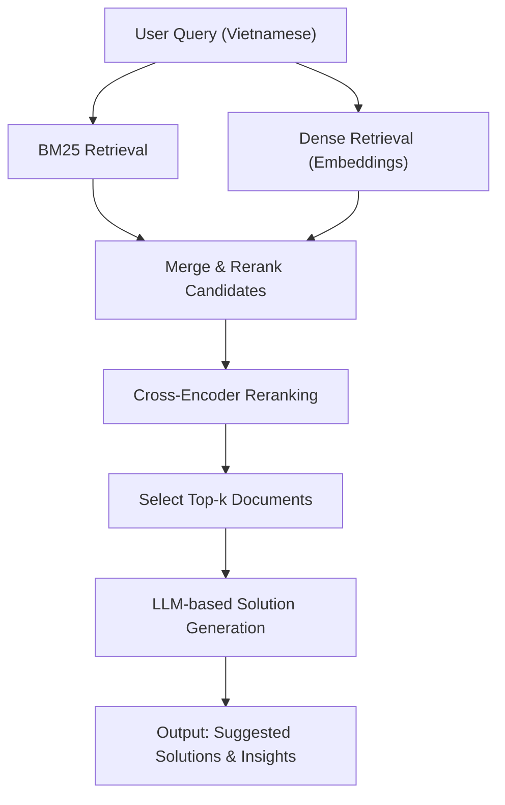

# Design Document: RAG Agent for Filum.ai Feature Knowledge Base

## 1. Agent Input Structure

### Structure
The Agent accepts user inputs as a natural language query in Vietnamese, representing a customer pain point.

**Example:**
```json
{
  "query": "Khách hàng phàn nàn về việc khó hiểu hành vi và trải nghiệm của họ tại các điểm chạm.",
}
```

**Rationale:**
- **Ease of Use:** Natural language queries are intuitive for users, such as customer support agents, requiring minimal training.
- **Extensibility:** Metadata supports future personalization, enabling tailored responses based on customer history or context.
- **Compatibility:** The text-based format integrates seamlessly with retrieval components (BM25Retriever, FAISS) and the LLM pipeline.

---

## 2. Agent Output Structure

### Structure
The Agent outputs a structured natural language response listing one or two Filum.ai features as solutions to the pain point. Each solution includes the feature name and a concise description of its benefits, formatted as a bullet-point list.

**Example:**
```
Potential Filum.ai Solutions:
- Experience Insights – Phân tích hành vi và trải nghiệm khách hàng tại từng điểm chạm để hiểu rõ hơn về nhu cầu và vấn đề của họ.
- Review Aggregation & Analysis – Thu thập và phân tích đánh giá từ nhiều nền tảng để xác định xu hướng và mức độ hài lòng của khách hàng.
```

**Rationale:**
- **Clarity:** The bullet-point format is user-friendly, making it easy for support teams to understand and act on recommendations.
- **Actionability:** Concise descriptions highlight how each feature addresses the pain point, aligning with Filum.ai’s customer-focused mission.
- **Integration:** The structured output can be parsed for use in chatbots, CRMs, or other systems, enhancing scalability.

---

## 3. Feature Knowledge Base Structure

### Structure
The Feature Knowledge Base is a collection of documents, each representing a Filum.ai feature, stored in a vector database (FAISS) for semantic search and indexed for keyword-based search (BM25). Each document includes:
- **Feature Name:** The name of the feature (e.g., "Experience Insights").
- **Description:** A concise Vietnamese description (`embedding_text`) for retrieval and response generation.
- **Metadata:** Fields like `chunk_id`, `category`, and `use_case` for filtering and context.

**Example:**
```python
docs_data = [
    {
        "chunk_id": "insights_experience_1",
        "feature_name": "Experience Insights",
        "category": "Insights",
        "use_case": "Phân tích trải nghiệm khách hàng",
        "embedding_text": "Hiểu rõ hành vi và trải nghiệm khách hàng tại từng điểm chạm bằng phân tích chủ đề và xu hướng phản hồi."
    },
    {
        "chunk_id": "voc_reviews_1",
        "feature_name": "Review Aggregation & Analysis",
        "category": "Voice of Customer",
        "use_case": "Tổng hợp và phân tích đánh giá",
        "embedding_text": "Thu thập đánh giá khách hàng từ nhiều nền tảng như Google, Facebook và phân tích xu hướng, từ khóa và mức độ hài lòng."
    }
]
docs = [Document(page_content=doc["embedding_text"], metadata={...}) for doc in docs_data]
```

**Rationale:**
- **Semantic Search:** FAISS with sentence-transformers embeddings enables semantic retrieval, capturing the intent of complex queries.
- **Keyword Search:** BM25 indexing supports precise keyword matching, ideal for specific feature-related queries.
- **Scalability:** The JSON-like structure allows easy updates to the knowledge base, supporting Filum.ai’s evolving feature set.
- **Metadata Utility:** Fields like category and use_case enhance retrieval precision by enabling context-aware filtering.

---

## 4. Core Logic & Matching Approach

### Core Logic
The Agent processes queries through a hybrid Retrieval-Augmented Generation (RAG) pipeline, as depicted in the flow diagram below:



#### Step-by-step:
- **User Query:** The process begins with a Vietnamese query (e.g., "Khách hàng phàn nàn về việc khó hiểu hành vi và trải nghiệm của họ tại các điểm chạm").
- **BM25 Retrieval:** The BM25Retriever retrieves documents based on keyword matches, scoring them using term frequency and inverse document frequency.
- **Dense Retrieval:** The query is embedded using sentence-transformers/all-MiniLM-L6-v2, and the FAISS retriever fetches the top k=6 semantically similar documents.
- **Merge & Rerank Candidates:** The EnsembleRetriever combines BM25 and dense retrieval results with weights (0.4 for BM25, 0.6 for dense) to produce a unified candidate set.
- **Cross-Encoder Reranking:** The CrossEncoder (cross-encoder/ms-marco-MiniLM-L-6-v2) scores query-document pairs, normalizing scores with a sigmoid function to select the top 5 documents.
- **Select Top-k Documents:** The top 5 documents form the context, including feature names and descriptions.
- **LLM-Based Solution Generation:** The ChatOpenAI model (google/gemma-3n-e4b-it:free) generates a response using a prompt template that includes the context and query.
- **Output:** A structured response lists one or multiple Filum.ai features as solutions.

### Matching Approach
- **BM25 Retrieval:** Matches documents based on keyword frequency, effective for precise, term-specific queries.
- **Dense Retrieval:** Uses sentence-transformers embeddings and FAISS to capture semantic similarity, ideal for nuanced or vague queries.
- **Ensemble Retrieval:** Combines BM25 and dense retrieval with weights (0.4 and 0.6) to balance precision and recall.
- **Cross-Encoder Reranking:** Refines the candidate set by scoring query-document pairs, ensuring high relevance.
- **LLM Generation:** Synthesizes retrieved documents into a natural language response tailored to the pain point.

**Rationale:**
- **Hybrid Retrieval:** Combining BM25 and dense retrieval ensures robustness across diverse query types, balancing keyword precision and semantic understanding.
- **Reranking:** The cross-encoder improves accuracy by prioritizing the most relevant documents, reducing noise in the context.
- **Weighted Ensemble:** The 0.4/0.6 weighting favors semantic search, aligning with the need to interpret complex customer pain points.
- **LLM Integration:** The LLM produces user-friendly, actionable responses, enhancing Filum.ai’s customer support capabilities.
- **Modularity:** The pipeline is extensible, allowing updates to the knowledge base, retriever weights, or LLM model.

---

## 5. Example Workflow

For the query: `"Khách hàng phàn nàn về việc khó hiểu hành vi và trải nghiệm của họ tại các điểm chạm."`

- **BM25 Retrieval:** Retrieves documents with keywords like "hành vi," "trải nghiệm" (e.g., "Experience Insights").
- **Dense Retrieval:** Fetches semantically similar documents (e.g., "Experience Insights" and "Review Aggregation & Analysis").
- **Ensemble Retrieval:** Merges results, prioritizing documents like "Experience Insights" (score: 0.6411).
- **Reranking:** The cross-encoder assigns "Experience Insights" the highest score (e.g., 0.8585).
- **Response Generation:** The LLM generates:

```
Potential Filum.ai Solutions:
- Experience Insights – Phân tích hành vi và trải nghiệm khách hàng tại từng điểm chạm để hiểu rõ hơn về nhu cầu và vấn đề của họ.
- Review Aggregation & Analysis – Thu thập và phân tích đánh giá từ nhiều nền tảng để xác định xu hướng và mức độ hài lòng của khách hàng.
```

---

## 6. Conclusion
This hybrid RAG Agent leverages BM25, dense retrieval, cross-encoder reranking, and LLM-based generation to deliver precise, actionable solutions for customer pain points using Filum.ai’s features. The input structure is intuitive, the output is user-friendly, the knowledge base is optimized for retrieval, and the core logic ensures robustness and scalability. Future enhancements could include dynamic retriever weights, expanded knowledge bases, or local LLMs to mitigate API rate limits.