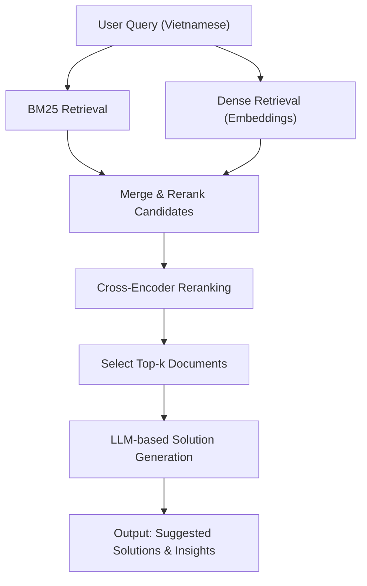

# Hybrid Search Pipeline (RAG + BM25) – Vietnamese Query Optimization

## Overview
This project implements a hybrid document retrieval pipeline tailored for Vietnamese queries, combining both traditional (BM25) and modern (dense embedding) retrieval methods. The system reranks results using a cross-encoder and uses a Large Language Model (LLM) to generate actionable responses to address customer pain points, making it ideal for customer experience analysis and solution recommendation.

---

## Setup Instructions

1. **Clone the repository:**
   ```bash
   git clone https://github.com/chrisHHieu/AI-Engineer-Assignments-Final.git

   cd AI-Engineer-Assignments-Final

   ```
2. **Install dependencies:**
   - Open the notebook `Hybird_Search_(RAG_+_BM25).ipynb` in Jupyter or VSCode.
   - The notebook will automatically handle most dependency installations, including any required version adjustments.
   - For best performance, use a Python environment with GPU support (CUDA) if available.

3. **Configure API Keys:**
   - If using OpenRouter or any external LLM API, ensure you have a valid API key and sufficient credits.
   - Set your API key in the notebook as instructed in the relevant cell.

---

## How to Run the Prototype

1. Open `Hybird_Search_(RAG_+_BM25).ipynb` in your preferred Jupyter environment.
2. Follow the notebook cells in order:
   - Set up dependencies and environment.
   - Load or edit your feature knowledge base (see below).
   - Input your pain point query (in Vietnamese).
   - Run the retrieval, reranking, and LLM-based solution generation pipeline.
3. Review the output: The notebook will display suggested solutions and insights for your input pain point.

---

## Sample Feature Knowledge Base Files
- The knowledge base is defined in the notebook as the `docs_data` variable (see Cell 3).
- You can edit or replace this list with your own feature documents.
- For larger datasets, you may load from a file (e.g., `features.json` or `features.csv`).

---

## Example Input Pain Points and Output

### Example 1
**Input Pain Point:**
```
Khách hàng phàn nàn về việc khó hiểu hành vi và trải nghiệm của họ tại các điểm chạm.
```
**Output:**
```
Pain Point: Chúng tôi không có ý tưởng rõ ràng về điểm tiếp xúc của khách hàng đang gây ra sự thất vọng nhất.
Potential Filum.ai Solutions:
- Experience Insights – Tính năng này sẽ giúp bạn hiểu rõ hành vi và trải nghiệm khách hàng tại từng điểm tiếp xúc, từ đó xác định chính xác điểm nào đang gây ra sự thất vọng nhất. Phân tích chủ đề và xu hướng phản hồi sẽ cung cấp cái nhìn sâu sắc về những vấn đề cụ thể mà khách hàng đang gặp phải.
- Review Aggregation & Analysis – Kết hợp với Experience Insights, tính năng này sẽ cung cấp thêm thông tin về những đánh giá khách hàng đang đưa ra trên các nền tảng khác nhau. Điều này giúp bạn xác định liệu sự thất vọng có liên quan đến những nhận xét tiêu cực trên mạng xã hội hay không, và từ đó đưa ra các biện pháp khắc phục phù hợp.
```

### Example 2
**Input Pain Point:**
```
Khách hàng phản ánh về thời gian phản hồi chậm khi liên hệ hỗ trợ.
```
**Output:**
```
Pain Point: Khách hàng không hài lòng với tốc độ phản hồi của bộ phận hỗ trợ.
Potential Filum.ai Solutions:
- Support Response Analytics – Phân tích thời gian phản hồi và xác định các điểm nghẽn trong quy trình hỗ trợ khách hàng.
- Automated FAQ & Chatbot – Đề xuất triển khai chatbot tự động để trả lời các câu hỏi thường gặp, giảm tải cho đội ngũ hỗ trợ và tăng tốc độ phản hồi.
```

---

## Requirements
- **Vietnamese Queries Only:** The pipeline is designed and optimized for Vietnamese. English or other languages may yield poor results due to non-optimized embedding and ranking models.
- Customizable query, retrieval weights, and number of documents (`k`).
- Dataset can be changed by editing the `docs_data` variable (see Cell 3 in the notebook).
- GPU acceleration is supported (if available) for faster embedding with sentence-transformers.

---

## Important Notes
- **Vietnamese Only:** For best results, ensure all queries and data are in Vietnamese. English queries are not recommended.
- If a `RateLimitError` occurs (OpenRouter API free tier limit), add credits or switch to a different model/endpoint.
- Some packages (e.g., `nvidia-cudnn-cu12`) require specific versions. The notebook will handle uninstalling/reinstalling conflicting versions automatically.
- If no GPU is detected, the system will default to CPU, which may be slower for embedding.

---

## Troubleshooting
- **RateLimitError:** Ensure a valid API key and sufficient credits on OpenRouter, or switch to a local LLM or another provider.
- **Dependency Conflicts:** If installation fails, try creating a new virtual environment and reinstalling dependencies.
- **No GPU Detected:** The system will automatically fall back to CPU if CUDA is unavailable.

---

## Flow Diagram

